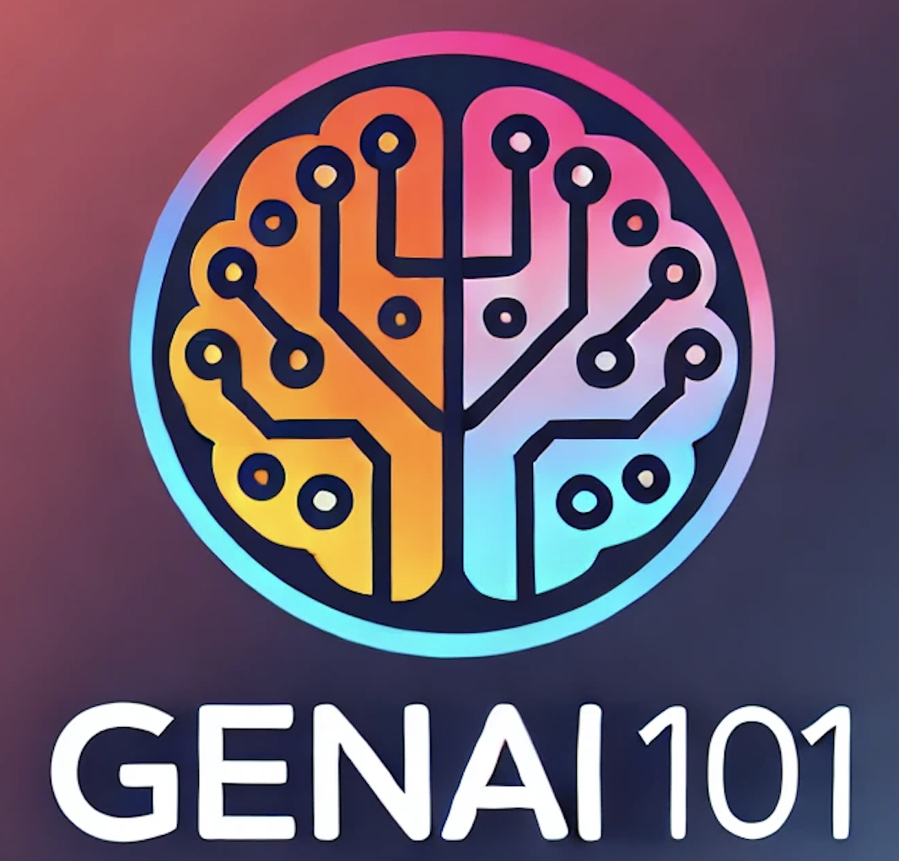

#   GenAI 101: Intro to GenAI and LLMs

This repository contains educational materials for understanding character-level language modeling using the Shakespeare dataset. The project demonstrates fundamental concepts in natural language processing and deep learning.

This repository contains materials and code examples for a hands-on course on getting started with Generative AI and Large Language Models (LLMs). The course is designed to help participants understand the fundamentals of GenAI and gain practical experience working with LLMs.

## Course Overview

This course will cover:
- Introduction to Generative AI and LLMs
- Understanding different types of LLMs and their applications
- Hands-on experience with popular LLM frameworks and tools
- Best practices for working with LLMs
- Real-world applications and use cases

This course uses local open-source LLMs via [ollama](https://ollama.com/) for inference and embedding tasks.
## Setup

The easiest way to get started is to use our setup script:

```bash
# Clone the repository
git clone https://github.com/marc-olm/genai101.git
cd genai101

# Run the setup script
./setup.sh
```

This script will:
1. Create a virtual environment
2. Install all required dependencies
3. Set up the Jupyter kernel
4. Configure everything you need to run the notebooks

## Project Structure

- `notebooks/`: Contains Jupyter notebooks with the course materials
- `data/`: Contains the Shakespeare dataset
- `requirements.txt`: Lists all Python dependencies
- `setup.sh`: Setup script to configure the environment

## License

This project is licensed under the MIT License - see the LICENSE file for details. 